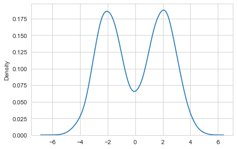
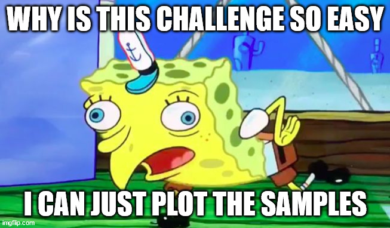

# Welcome to the Challenge of the MCMC Course!

## Gaussian Mixture Model

A common model in Machine Learning is the *Gaussin Mixture Models (GMM)*. A GMM is the sum of multiple normal distributions $\mathcal{N}(\mu, \sigma)$ and its density is:

$$p(x) = \sum_{i=1}^{k}\frac{p_i}{\sqrt(2\pi\sigma_i^2)}exp(-\frac{(x-\mu_i)^2}{\sigma_i^2})$$

Here, $k$ is the number of Normal Distributions, $p_i$ is the probability to belong to Normal Distribution $i$, $\mu_i$ is the mean of Normal Distribution $i$ and $\sigma_i$ is the standard deviation of Normal Distribution $i$. For the rest of this workshop we set $p_i = \frac{1}{k}$.

For example, the density of a GMM consisting of two Normal Distributions with means at -2 and 2 and unit variance looks like this:

## Challenge Definition

We have generated samples from a two-dimensional GMM (saved in samples_1.csv). Your task will be to estimate the respective means and standard deviations of the distributions using Markov Chain Monte Carlo. Make sure to first install all dependencies from the [requirements file](requirements.txt).

## Getting Started

We have defined a baseline [model](run_me.ipynb) to help you get started. This model should run on your computer without any changes. Your task will be to improve the existing model. You can also find some hints in the notebook but feel free to change whatever you want as long as you stick to MCMC.

## Evaluation

At the end of the challenge, every team submits their model. We will run it on the same computer (so that each team has the same hardware performance). Whichever team has the highest Effective Sample Size per Second wins. Please be aware that we run the model on data from another GMM so don't hardcode anything! For simplicity you may assume that we sample from a two dimensional GMM.

## Submission Details

Please submit a notebook similar to run_me.ipynb which returns the Effective Sample Size per Second (ESS/ Second). Please don't get funny with things like *ESS = 2 * ESS*, we will check your code. Also please try to avoid the excessive use of non-standard libraries; we want to run your code and not spend ages getting it to run. Apart from the already imported libraries you do not need any other libraries to achieve good results.

## Final Remarks

Our requirements for the challenge were twofold:
- Easy to understand and visualize
- Possible to make many improvements to the model in a short amount of time

Usually, MCMC is used in far more complex scenarios (imagine the same problem in a 1000 dimensional space) where other approaches are not possible.
